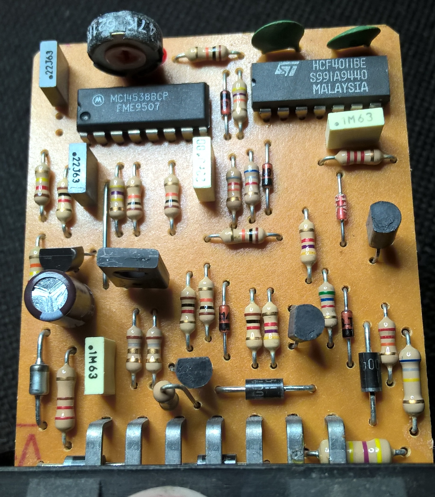
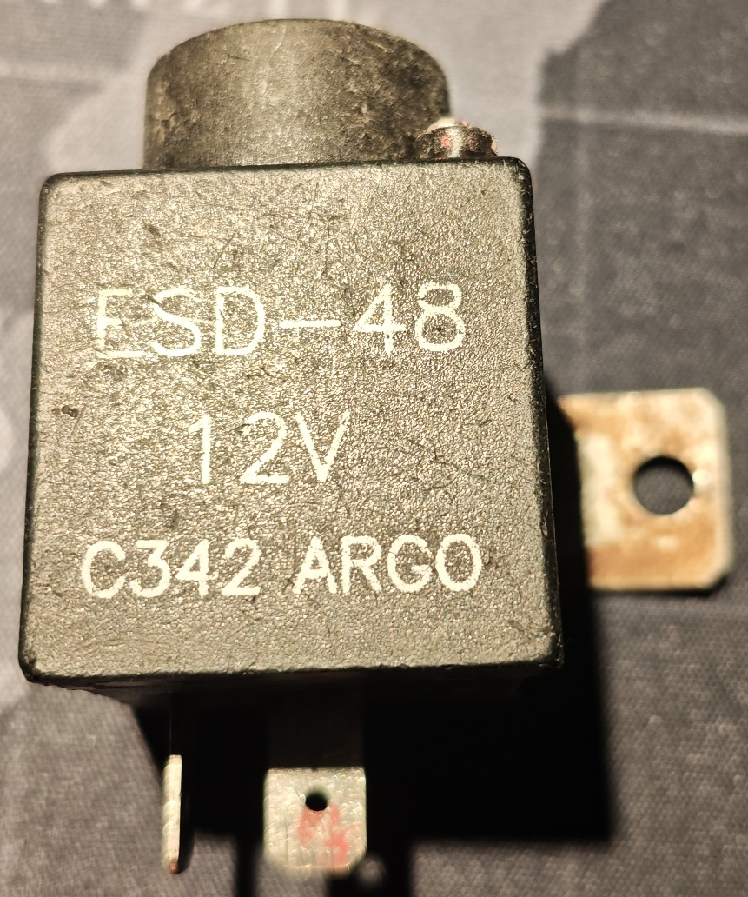
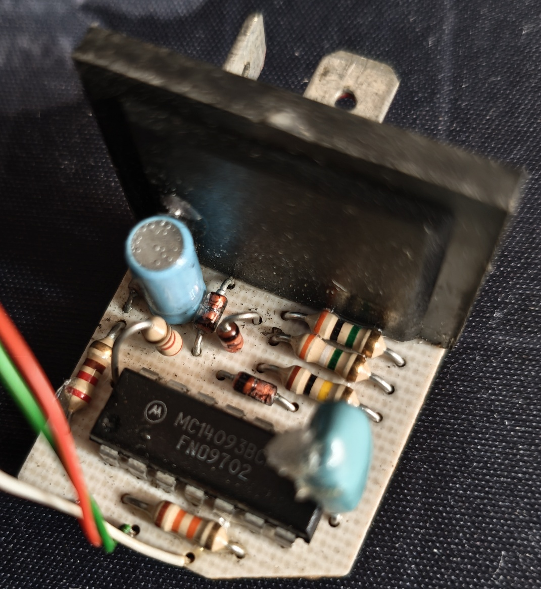
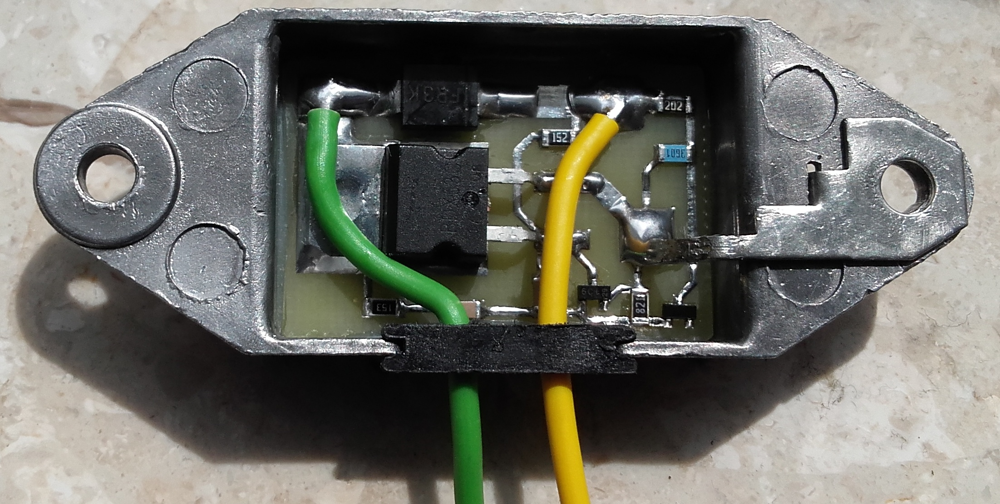

# Information about OE Fiat 126p Modules

## CUT-OFF Module

Schematic of a fuel cut-off module for carburetor engines equipped with a catalytic converter.

Originally drawn in 2018 using Eagle 7.6.0. The project has now been made public and imported into KiCad 9.0.8.

## ESD-48 Module

Schematic of an acoustic choke warning signalizer.

## RNc-12 Module

Recreation of the alternator voltage regulator. The new PCB fits into the original housing and was used to fix the faulty regulator in the car.

Originally designed on June 4, 2018, using KiCad 5.0.0-rc2. The project has now been made public and imported into KiCad 9.0.8.

# Disclaimer

I do not consent to the use of all or part of the project for commercial purposes!

Nie wyrażam zgody na wykorzystanie całości bądź części projektu w celach zarobkowych!

# License

Shield: [![CC BY-NC-SA 4.0][cc-by-nc-sa-shield]][cc-by-nc-sa]

This work is licensed under a
[Creative Commons Attribution-NonCommercial-ShareAlike 4.0 International License][cc-by-nc-sa].

[![CC BY-NC-SA 4.0][cc-by-nc-sa-image]][cc-by-nc-sa]

[cc-by-nc-sa]: http://creativecommons.org/licenses/by-nc-sa/4.0/
[cc-by-nc-sa-image]: https://licensebuttons.net/l/by-nc-sa/4.0/88x31.png
[cc-by-nc-sa-shield]: https://img.shields.io/badge/License-CC%20BY--NC--SA%204.0-lightgrey.svg
